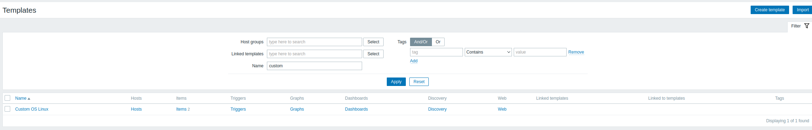
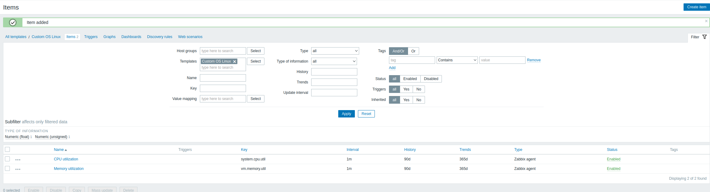
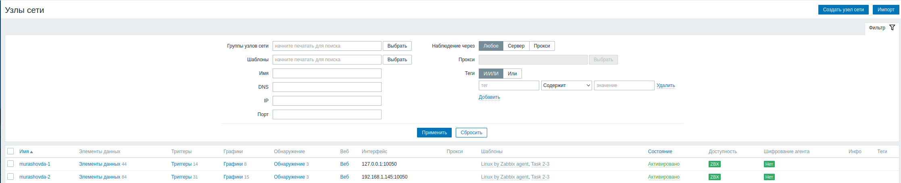
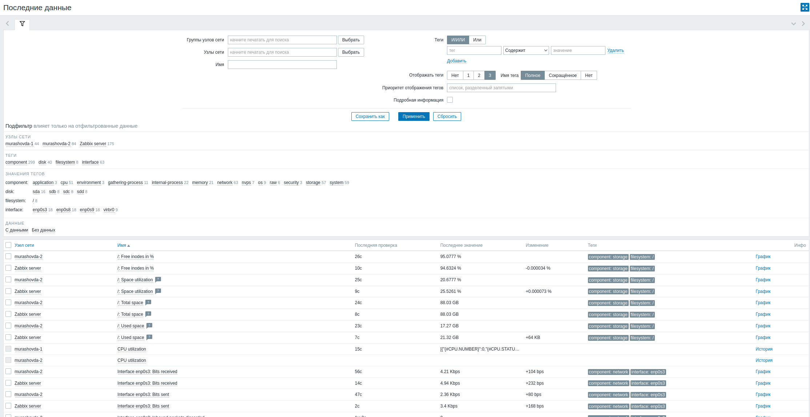
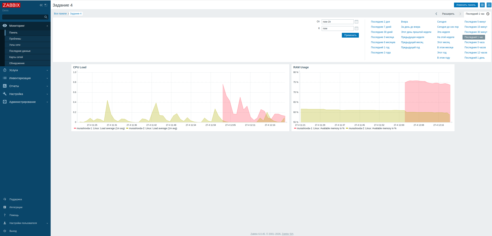

# Система мониторинга Zabbix. Часть 2 - Мурашов Денис

## Задание 1

Создан кастомный шаблон для мониторинга загрузки CPU и RAM.

## Задание 2-3

Хосты успешно добавлены в Zabbix Server. К каждому хосту привязаны шаблоны "Linux by Zabbix Agent" и кастомный шаблон из Задания 1. 

## Задание 4

Создан кастомный дашборд для визуализации метрик с добавленных узлов. Выведены графики загрузки процессора и оперативной памяти.

